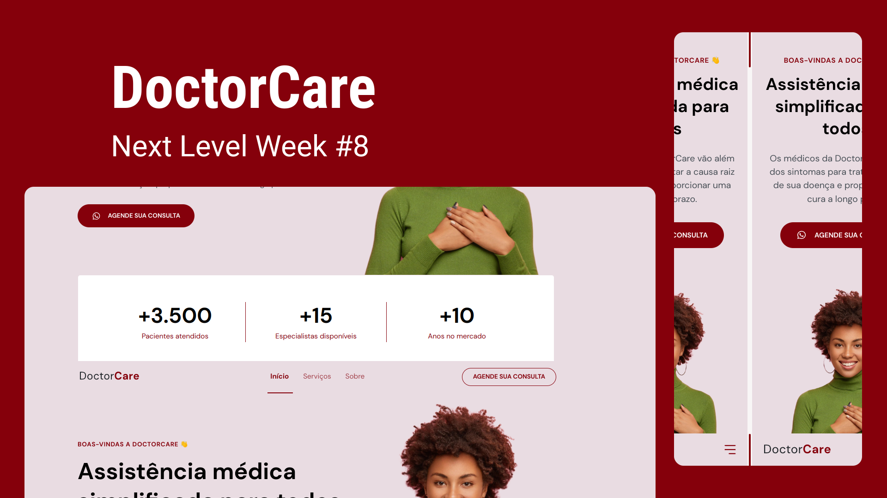

  

<h2>Site published <a href="https://francissverissimo.github.io/doctorCare/">here</a></h2>

## Technologies

This project was developed with the following technologies:

  
  
  

Libraries

- [Google Fonts](https://fonts.google.com/)
- [ScrollRevel](https://scrollrevealjs.org): animate page elements when scrolling.

## Project

  DoctorCare is an institutional page in the One Page format, responsive, to be used in various types of micro, small and medium-sized companies. Contains the following sections: Header, Navigation, Home, About, Services and Footer

